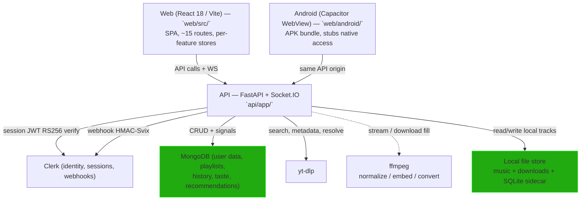

# Rheoson — Architecture

> Read [README](../README.md) first for the 5-minute overview. This page is the system map: how the pieces fit, where data lands, and where the failure paths are.

> For endpoint-level auth rules and request/response shapes, see [API Reference](API.md) and the live Swagger at `GET /api/docs`. For deep pipelines, see [Streaming](STREAMING.md) and [Downloads](DOWNLOADS.md).

## System map

| Layer | Where | What it owns |
|-------|-------|--------------|
| Entry point | `api/app/main.py` | mounts Socket.IO, registers routers, starts cron (APScheduler), configures CORS builtins + CORS_ORIGINS additive override, exposes `/health`, `/docs`, `/ws` |
| Core | `api/app/core/` | settings, auth, deps, DB, health, exceptions, logging |
| Routers | `api/app/routers/` | thin handlers; validation (Pydantic) at the boundary, business logic in services |
| Services | `api/app/services/` | search, ytmusic, metadata, stream, download, lyrics, artwork, local_history, track_identity, recommendation/taste, signal, spotify |
| Data | `api/app/core/database.py` + `app/services/track_identity.py` | MongoDB (Motor) + SQLite sidecar + local JSON mirror |

The frontend is a React SPA with ~15 routes (`web/src/router.tsx`), global client state split across focused stores (`web/src/store/`), and a thin typed API client (`web/src/api/`). The mobile build is the same SPA wrapped by Capacitor (`web/capacitor.config.ts`, `web/android/`); the APK bakes the production API origin at build time via `import.meta.env.PROD`.

## Backend architecture

### How a request is authenticated

1. The Clerk Provider obtains a session JWT (`getToken()`) and the API client injects it in the `Authorization: Bearer …` header (`web/src/api/client.api.ts`).
2. `get_current_user` (in `api/app/core/deps.py`) verifies the token against Clerk's JWKS (cached ~1 h), enforcing RS256 + an `iss` allowlist + `exp`/`nbf`.
3. User-scoped handlers key storage by `claims["sub"]` — per-user files get `.liked-.json`-style names; MongoDB queries filter by `user_id`.
4. Dev fallback (`dev-user-local`) exists **only** when `ENV=development` AND Clerk is unconfigured. In production, missing Clerk config means every protected endpoint 401s — fail closed.
5. Clerk session tokens are short-lived (~60 s). The client sends no token until one is available and briefly retries 401s on cold start instead of bouncing the user.

Dev-mode bypass and the auth-rule machinery are documented in [Auth & Security](AUTH.md).

### Service map

| Module | Responsibility |
|--------|----------------|
| `search_service.py` | Search fanout across YouTube Music + Spotify, deduplication, asynchronous bodies; throttled to avoid blocking on a single provider |
| `ytmusic_service.py` | YouTube Music client via `ytmusicapi`; thumbnails, artist browse, album/single payload |
| `metadata_service.py` | Metadata extraction + local track identity (`MD5(str(path))[:16]` as the local-file id) |
| `stream_service.py` | yt-dlp fill, buffering, format negotiation; shared, bounded, disconnect-proof background fills per track |
| `download_service.py` | Job lifecycle (POST → 202 → worker → final file), per-job staging dir, sanitization, path containment, dedupe counters, retries, speed-limit, concurrency |
| `lyrics_service.py` | Synced lyrics retrieval from external providers |
| `artwork_service.py` | Extract embedded artwork from local files; fetch remote artwork; artwork proxy for clients that can't reach CDNs |
| `local_history.py` | File-mirrored per-user play/like history; the local fallback when MongoDB is absent |
| `track_identity.py` | **SQLite sidecar** mapping each YouTube videoId to its downloaded file; gets download jobs recorded into it; invalidated on download |
| `recommendation_engine.py` + `taste_profiler.py` + `taste_utils.py` | Taste signals, profile, genre affinity, Daily Mix, Radio, For-you, Discover, Trending rails |
| `signal_service.py` | Records play-complete / repeat / skip / queue-add / download signals; the feedback loop that trains recommendations |
| `spotify_service.py` | Spotify-enhanced search and metadata when configured |

### Core (`api/app/core/`)

| Module | Responsibility |
|--------|----------------|
| `config.py` | Pydantic-settings + `validate_startup()` (production fails hard on missing Clerk secret); source `api/app/core/config.py` |
| `auth.py` | Clerk JWKS fetch/cache, RS256 verification, Clerk Backend API helpers |
| `deps.py` | `get_current_user` — the single auth dependency; dev fallback only when `ENV=development` AND Clerk unconfigured; otherwise fail-closed |
| `database.py` | Motor client lifecycle, index creation, `db_available()`, graceful degradation |
| `health.py` | Liveness/readiness/diag payloads, background probe loop, bounded metrics ring |
| `exceptions.py` | `RheosonException` hierarchy + handlers (no stack traces to clients) |
| `logging.py` | structlog JSON config, request-ID contextvars |

## Data model

MongoDB holds user-scoped data: users, playlists, liked track ids, search/play history, taste profile, recommendation state, signal aggregates. The local JSON mirror (`services/local_history.py`) store plays and likes per user as files beside the library when MongoDB is absent — and the local track-identity sidecar lives in `api/app/services/track_identity.py`.

### Local track identity

Before v2.16.1, a download changed a track's id: search used `videoId` (YouTube), the library scan produced `MD5(path)[:16]`. Same song appeared twice and `isDownloaded` was unreliable. The fixed model:

- Search and library both expose whatever identity they have.
- `track_identity.py` (SQLite) records `videoId ↔ fileId` whenever a download completes.
- Restarts and library rescans preserve the mapping; deleted files don't resolve to broken local entries.
- `GET /tracks/{videoId}` resolves to the local file when it exists.

The `MD5(path)[:16]` id remains the local-file identity contract — see `app/services/metadata_service.py` and the `hashlib.md5(str(path).encode()).hexdigest()[:16]` helper in `app/services/download_service.py`. That function is the identity contract for local files; if it changes, every cached URL breaks.

## Authentication flow

1. Frontend (Clerk Provider) obtains a session JWT via `getToken()` and injects it into the `Authorization` header (`web/src/api/client.api.ts`).
2. `get_current_user` verifies the token against Clerk's JWKS (cached ~1 h), enforcing RS256 + `iss` allowlist + `exp`/`nbf`.
3. Every user-scoped handler keys storage by `claims["sub"]` — file stores get per-user filenames, MongoDB queries filter by `user_id`.
4. Dev fallback (`dev-user-local`) exists **only** when `ENV=development` and Clerk is unconfigured. In production, missing Clerk config means every protected endpoint 401s — fail closed.
5. Clerk session tokens are short-lived (~60 s). The API client sends no token until one is available and briefly retries 401s on cold start instead of bouncing the user.

> Note on dev identity: `get_current_user` checks `settings.is_dev and not settings.has_clerk`. A synthetic `dev-user-local` sub is issued so the UI can render for an unauthenticated local user. That fallback is intentional for local dev only; in production `has_clerk` is `True` whenever `CLERK_SECRET_KEY` is set, so the branch is never taken.

## Isolation rules (tested in `api/tests/test_auth_guard.py`)

- Likes, history, playlists are invisible across users.
- Foreign playlist GET/PATCH → `404`; DELETE is idempotent `204` but deletes nothing it doesn't own.
- Webhook events can never be forged without the signing secret (Svix HMAC, timestamp window, fail-closed).
- The download and stream pipelines are scoped to the requesting user; `get_current_user` is the user-identity source of truth on both paths.

## Streaming pipeline (the hot path)

A stream resolve walks three caches in order, with live fills filling gaps under a bounded concurrency ceiling.

1. **Local index hit** — serve from disk with full `Range` support (206, correct MIME per container).
2. **Remote cache hit** — completed yt-dlp fills; TTL 30 min, LRU cap 30 tracks; files unlinked on eviction.
3. **Live fill session** — one background task per track (bounded to 6 concurrent). The first request that arrives mid-warm waits for the fill to land in the buffer; subsequent requests join the same session. Taps shortly after selection start from already-landed bytes; skip/auto-advance warms the next tracks on play.

Failure behavior for the streaming path:

- yt-dlp extraction failures → 404 with a structured message, not a stack trace.
- ffmpeg failures → 500-class, logged, client gets a generic message.
- Network interruption mid-fill → the fill is cancelled; subsequent requests restart it.
- Restart detection — on server restart, in-flight fills are abandoned (process groups killed), cache survivor survives if TTL remains.

Full lifecycle, ffmpeg options, retries, speed limits, and the artwork proxy are in [Downloads](DOWNLOADS.md) and [Streaming](STREAMING.md).

## Deployment surface

Three shapes of deployment share the same API and frontend:

- **Termux (primary, self-hosted)** — the API runs on-device at `127.0.0.1:8000`, the frontend is loaded in a Capacitor WebView as a native APK. The APK bakes the production API origin at build time via `import.meta.env.PROD`.
- **Render (secondary, cloud)** — free-tier ephemeral disk. Streaming only (yt-dlp pipe) in this config; downloads and persistent library data require a local backend or persistent disk. The built-in keep-alive pinger mitigates Render's 15-minute inactivity timeout.
- **Docker (optional)** — containerized backend and optional nginx. See [Deployment](DEPLOYMENT.md).

## Where the failure paths live

| Concern | Where it's handled | Pattern |
|---------|-------------------|---------|
| Auth bypass (dev mode) | `get_current_user` + `test_auth_guard.py` | Guarded by `is_dev && !has_clerk` |
| Per-user isolation | user-scoped handlers + local_history per-sub files | sub-keyed reads/writes |
| Rate limiting | per-IP, per-route (search/download/auth/stream/lyrics) | bounded, documented in config |
| CORS | builtins in `main.py` + additive `CORS_ORIGINS` (no wildcard default) | origin allowlist |
| SSRF / open redirect on resolve | netguard allowlist + known-CDN enforcement on stream resolve | deny-list is insufficient; allowlist only |
| Webhook forgery | Clerk webhook router — Svix HMAC + timestamp freshness | fail-closed without secret |
| Stack-trace leakage | `exceptions.py` handlers | mapped exceptions to client-safe messages |
| Download path traversal | sanitization + path containment in `download_service.py` | canonicalize + prefix check |
| Process leak on cancel / restart | download and stream fill cancellation kills process groups | process group + signal handling |

## Cross-cutting config

Tunable values live in `api/app/core/config.py`:

- `ENV`, `API_HOST`, `API_PORT`
- Library: `MUSIC_DIR`, `DOWNLOADS_DIR`, `EXTRA_MUSIC_DIRS`
- Downloads: `AUDIO_FORMAT`, `AUDIO_QUALITY`, `MAX_CONCURRENT_DOWNLOADS`
- MongoDB: `MONGODB_URL`, `MONGODB_DB_NAME` (optional — degrades to local mirror)
- Clerk: `CLERK_SECRET_KEY`, `CLERK_PUBLISHABLE_KEY`, `CLERK_WEBHOOK_SECRET`
- Redis (optional backend): `REDIS_URL`
- Secrets: `SECRET_KEY` (required in production by startup validation)
- Spotify (optional): `SPOTIFY_CLIENT_ID`, `SPOTIFY_CLIENT_SECRET`
- Rate limits: `RATE_LIMIT_SEARCH` / `DOWNLOAD` / `AUTH` / `STREAM` / `LYRICS`
- Admin: `ADMIN_SUBS` (Clerk subs allowed to mutate instance config)
- CORS additive override: `CORS_ORIGINS` (no wildcard default)
- Render keep-alive: `RENDER_API_URL`

*The local copy is authoritative.* Defaults and semantics are described in [Deployment](DEPLOYMENT.md) and the `.env.example` template; this table is the summary.

## The pieces that changed recently

- **Clerk auth** — prebuilt Clerk components replace custom login/register; JWT injection on API requests; webhook syncs users to MongoDB. See [Auth & Security](AUTH.md).
- **Per-user isolation** — likes, history, playlists, and taste are now user-scoped; guest mode removed.
- **Streaming hardening** — shared, bounded, disconnect-proof background fills; cancellation kills the fill; rate limits on stream/audio.
- **Downloads hardening** — per-job staging dir, sanitization, path containment, dedupe counters, retries, speed-limit slider, concurrency limiter.
- **Track identity** — SQLite sidecar (`track_identity.py`) so `isDownloaded` is reliable and liked/history/playlist entries resolve to local playback.
- **Health system** — liveness/readiness/snapshot/diagnostics with bounded background probing; keep-alive cold-start bug traced to a dead ping target.
- **Recommendations** — taste profile with genre affinity, Daily Mix, Radio, dislike/hide; cross-device playback sync via authenticated WebSocket with newest-wins conflict handling.
- **Onboarding/guarded routing** — `OnboardingGate` + Clerk `routing="path"` at `/auth`; the router registers `/auth/*` so Clerk's multi-step flows (verify, factor-one, SSO callback) complete on sub-paths instead of bouncing back to Landing.

*Last verified against `main`: 2026-09-10 (v2.17.4, tag `v2.17.4`).*
