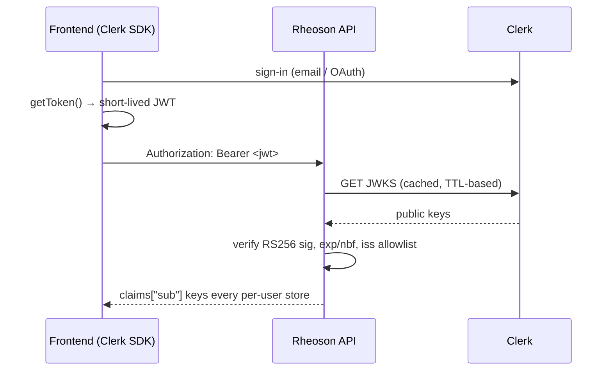

# Deep Dive — Auth & Security

> Companion pages: [API Reference](API.md) (endpoint-level auth), [Deployment](DEPLOYMENT.md) (secrets setup). This page explains the security model and its reasoning. Exact allowlists and limits live in the code (`app/core/auth.py`, `app/services/netguard.py`, `app/core/deps.py`).

## Account contract

Sign-up collects exactly three things, and nothing else:

| Field | Rules |
|-------|-------|
| **Username** | Required, unique. `3–32` characters from `A–Z a–z 0–9 _ .`. It is the display name and the handle a future messaging feature addresses people by. |
| **Email or phone** | At least one is required. Clerk treats them as one identifier field: supplying neither is a sign-up error, supplying either is sufficient. |
| **Password** | At least 8 characters. |

There is **no first name and no last name** — this product has one identity
field. The server stores `username` on the user document and validates its
shape on every write; uniqueness is Clerk's, enforced at sign-up.

These are Clerk instance settings (Dashboard → User & Authentication), not
application code, because sign-in happens in Clerk's own components. The
roadmap records the exact configuration in `docs/ROADMAP.md` (v2.19.3).

> **Note on password length.** NIST SP 800-63B recommends 15 characters for
> single-factor authentication and 8 when a second factor is present. 8 is the
> configured minimum; if MFA is not enabled on the Clerk instance, raising it
> to 15 is the stronger choice.

## Identity model

- The backend verifies Clerk session JWTs: RS256 signature from Clerk's JWKS (fetched with the secret key, cached with a TTL, stale cache served on transient fetch failures), expiry/not-before checks, and an issuer check on the parsed **hostname** — accepting `*.clerk.accounts.dev` and `*.clerk.com`, or an exact `CLERK_ISSUER` when a custom domain is configured. Substring matching is not used: it would accept a host that merely contains `clerk.com`.
- **There is no server-side login or registration route.** Clerk's Backend API can mint a session for a user id without verifying a password, so a credential proxy would reduce "know the password" to "know the email address". Administering that capability is exactly what the removed `/auth/login` did wrong.
- There is deliberately **no "decode without verification" fallback** — an unauthenticated decode path would make the auth layer decorative.
- The canonical user key is the `sub` claim. Every per-user store (likes, history, playlists, signals, analytics) keys by it.

### Fail-closed rules

| Situation | Behavior |
|-----------|----------|
| `ENV=production`, Clerk unconfigured | API refuses to boot (startup validation) |
| `ENV` unrecognised (a typo, or empty) | Treated as `production` — fail closed, with the bad value reported at startup |
| Clerk configured, token missing/invalid/expired | `401` on every protected endpoint |
| `ENV=development`, Clerk unconfigured | Synthetic `dev-user-local` identity (explicitly documented, dev-only convenience) |
| Webhook secret unset | `503` — webhooks never accepted unverified |

## Public surface (deliberate)

The only unauthenticated routes, each justified:

- **Health/meta** (`/api/health`, `/health/live`, `/health/ready`, `/api/version`) — liveness/orchestration; payload contains no secrets or private paths.
- **Media byte routes** (`GET/HEAD /api/stream/{id}/audio`, artwork routes) — `<audio>`/`` elements cannot attach Authorization headers. They are read-only streams of validated, shape-checked resource IDs (11-char YouTube IDs or library file IDs). Every *stateful* stream route (warm, cache clears) requires auth.
- **Share card** (`/api/share/{id}/card`) — OG-image generator for link previews; renders title/artist text into SVG.
- **Clerk webhook** — authenticated by Svix HMAC signature instead of a bearer token.

## Webhook security chain

1. `503` when the signing secret is unset (fail closed, all environments).
2. Svix headers required (`svix-id`, `svix-timestamp`, `svix-signature`).
3. Timestamp freshness window (rejects replayed deliveries).
4. HMAC-SHA256 over `"{id}.{timestamp}.{body}"` with the base64-decoded secret, constant-time compared against every `v1,…` signature entry.

Only after all four does the event reach handlers; handlers are best-effort and never crash the endpoint.

## Per-user isolation

- File-backed stores use per-user filenames (`.<kind>-.json` under the music dir).
- MongoDB queries always filter by `user_id`.
- Cross-user access attempts yield `404` (existence hidden), not `403`; playlist deletion by a non-owner is idempotent and deletes nothing.
- The test suite (`api/tests/test_auth_guard.py`) pins all of this: anonymous 401 sweep across every router + explicit isolation tests for likes, playlists, and history.

## SSRF defense (netguard)

Every server-side fetch (search resolve, downloads, artwork proxy) passes:

1. Scheme restricted to `http`/`https`; no embedded credentials; sane port; length cap.
2. Host must be on the media allowlist (YouTube, Spotify, SoundCloud, Bandcamp, Deezer, Tidal, Apple, Vimeo, Twitch, Mixcloud, Audiomack and their CDNs).
3. Hostname must resolve **only** to public addresses — loopback, private ranges, link-local (cloud metadata), and reserved nets are rejected.
4. The artwork proxy uses a separate, stricter image-CDN allowlist.

**Known hardening gap (documented, accepted):** DNS is resolved at validation time and the fetch happens afterwards — a hostile authoritative DNS could rebind between check and fetch (TOCTOU). Exploiting it requires control of an allowlisted domain's DNS. Mitigation roadmap: pin the resolved IP for the actual fetch or resolve inside the fetch client.

## Transport & headers

Middleware sets on every response: `X-Content-Type-Options`, `X-Frame-Options`, `Referrer-Policy`, and HSTS for non-localhost hosts. CORS is an explicit allowlist (built-ins + additive `CORS_ORIGINS`); credentials are not allowed with wildcard origins; the Socket.IO server mirrors the same allowlist. Swagger is exposed at `/api/docs` — disable it at the reverse proxy if you don't want it public.

## Rate limiting

Per-IP sliding-window limiter per path prefix (search/downloads/auth/stream/lyrics), bounded key count, `429` + `Retry-After`. Optional Redis backend for multi-instance deployments. See [API reference](API.md#rate-limits) for the shape.

## Secrets handling

- `.env` files are git-ignored; `.env.example` documents every key without values.
- Production startup **fails** without required secrets — misconfiguration can't happen silently.
- Logs carry request IDs and event names, never tokens or secrets; database URLs are redacted before logging.
- Secret rotation: Clerk keys and the webhook secret rotate independently; the webhook accepts overlapping secrets during rotation (Svix behavior).

## Vulnerability reporting

See [SECURITY.md](SECURITY.md) — private disclosure, no public issues.

---

*Last verified against `main`: 2026-09-10 (v2.16.5).*
