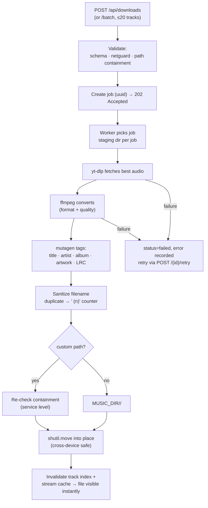

# Deep Dive — Download Pipeline

> Companion pages: [Streaming](STREAMING.md) (playback path), [Data](DATA.md) (where files land). Option defaults live in `api/app/core/config.py` and the download schemas.

## Lifecycle

## Job model

- Jobs are in-memory with JSON persistence after every mutation, so a restart restores history.
- Every option is recorded **at enqueue time** — retries replay the exact same format, quality, embed flags, and destination.
- The job list is trimmed to a bounded window by a cron job (see [Operations](OPERATIONS.md)).
- Job IDs are UUID-format-validated on every job-scoped route; malformed IDs get a clear `400` before any lookup.

## Validation layers

1. **Schema** — Pydantic models constrain format/quality enums, lengths, and types (`422` on violation).
2. **netguard** — URLs must be `http(s)`, on the media-host allowlist, credential-free, and resolve only to public IPs (SSRF defense; see [Auth & Security](AUTH.md)).
3. **Path containment** — `customPath` must resolve inside a configured music directory. Checked in the router **and** re-checked in the service (defense in depth): without this, an authenticated user could write audio anywhere the process can.
4. **Filename sanitization** — filesystem-illegal characters stripped; Unicode titles are preserved; collisions get ` (2)`, ` (3)`, … counters.

## Conversion & tagging

- yt-dlp extracts best-available audio; ffmpeg transcodes to the requested container/quality. ffmpeg must be on PATH — its absence fails the job with a clear error.
- mutagen writes ID3/FLAC/MP4 tags: title, artist, album, embedded artwork (fetched via the artwork service), and synced LRC lyrics when enabled and available.
- Tagging failures degrade gracefully — the audio file is still delivered, with the error noted on the job.

## Cancellation

`POST /api/downloads/{id}/cancel` SIGTERMs the process group, escalates to SIGKILL after a grace period, removes partial staging files, and marks the job `cancelled`. A cancelled job never leaves orphaned processes or half-written library files.

## Concurrency

Worker concurrency is configurable per job request and bounded by `MAX_CONCURRENT_DOWNLOADS`. Progress events stream to clients over Socket.IO (`download:progress`, `download:done`, `download:error`) — see the [API reference](API.md#websocket-socketio).

## Where files land

Default layout (no custom path): `MUSIC_DIR/<Artist>/<Title>.<ext>` — exactly the structure the library scanner and stream index read. Custom paths may target any configured music directory or subdirectory. After completion the track index and stream caches are invalidated so the next request sees the file — no restart.

---

*Last verified against `main`: 2026-09-10 (v2.16.5).*
