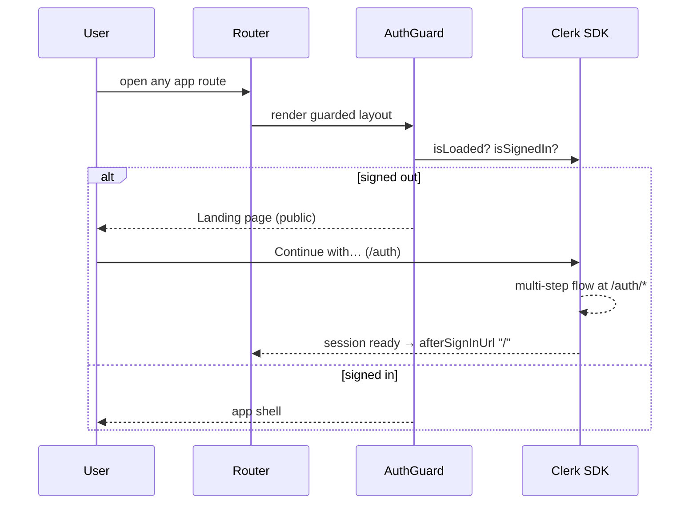

# Deep Dive — Frontend Internals

> Companion pages: [Architecture](ARCHITECTURE.md), [Mobile / Android](MOBILE.md). Source: `web/src/`.

## Stack

React 18 · TypeScript · Vite · Tailwind CSS · Zustand (client state) · TanStack React Query (server state) · Howler.js (audio) · Framer Motion (animation) · socket.io-client (realtime) · Workbox (PWA) · Capacitor (Android shell).

## State management

Client state lives in small Zustand stores; server state flows through React Query with typed API modules per backend family:

| Store | Owns |
|-------|------|
| `player.store` | Current track, playback state, volume, repeat/shuffle, crossfade settings |
| `queue.store` | Queue contents and order |
| `download.store` | Job list fed by REST + Socket.IO events |
| `auth.store` | Session/user mirror synced from Clerk (see below) |
| `ui.store` | Layout prefs (nav position), modals, toasts |
| `theme.store` | Accent theme, applied pre-paint to avoid flash |

## Audio: one Howl to rule them all

Exactly one global Howler instance (`html5: true`) exists. Every "play" swaps its source — there is never a second active audio element, which eliminates doubled/piled audio bugs. Local (downloaded) tracks load straight from disk or the SW cache; remote tracks stream via the API's byte-range endpoint. The Web Audio context is resumed on first user gesture (browser autoplay policy), and Media Session metadata wires lock-screen controls.

## API client funnel

All HTTP goes through one `request()` function that layers:

1. **Auth injection** — Clerk token when available; in local mode, the persisted session token.
2. **Offline handling** — flagged mutations are queued to IndexedDB instead of failing; replayed on reconnect (`offlineQueue`).
3. **Retry with backoff** — network errors retry twice before surfacing "cannot reach the API server".
4. **Clerk-aware 401 semantics** — a 401 without a token (cold start) retries briefly; a 401 with a token never hard-redirects (Clerk owns the session and the guard unmounts the app when it's genuinely gone). Auth endpoints always surface 401s to their forms.
5. **Content-type guard** — HTML responses (wake-up pages, proxies) become readable errors instead of JSON parse crashes.

## Authentication flow

Key invariants (regression-tested in `web/src/__tests__/authRoutes.test.ts`):

- The Clerk auth components are mounted with path routing at `/auth` **and `/auth/*`** — Clerk's multi-step flows (verification, MFA, SSO callback) navigate sub-paths. The missing wildcard historically bounced mid-auth users back to the landing page.
- Post-auth navigation belongs to Clerk alone (`afterSignInUrl`/`afterSignUpUrl`); no component adds its own redirect on top.
- The splash screen covers boot; while Clerk restores a session the guard renders a branded loader, never the landing page — so a signed-in restart never flashes marketing.

## Realtime

One socket.io connection (origin-level URL, not `/api`), auto-reconnect with backoff. Download events merge into the download store; on reconnect the store re-fetches state so a missed event can't wedge the UI. Cross-device playback sync listens for `player:state` broadcasts from the account's other sessions.

## Offline & PWA

- Workbox service worker (`injectManifest`): precaches the app shell, caches artwork, and serves offline audio with range-request support.
- IndexedDB (via `idb`) plus Capacitor Filesystem on Android hold the local library mirror and download state.
- The offline mutation queue replays writes when connectivity returns; a network-status banner reflects online/offline transitions.

## Route map

`/` home · `/search` · `/library` · `/downloads` · `/settings` · `/profile` · `/stats` · `/wrapped` · `/playlist/:id` · `/album/:id` · `/artist/:id` · `/recently-played` · `/trending` · `/featured` · `/full-player` · public: `/` (landing when signed out), `/auth(/…)` · 404 catch-all.

---

*Last verified against `main`: 2026-09-10 (v2.16.5).*
