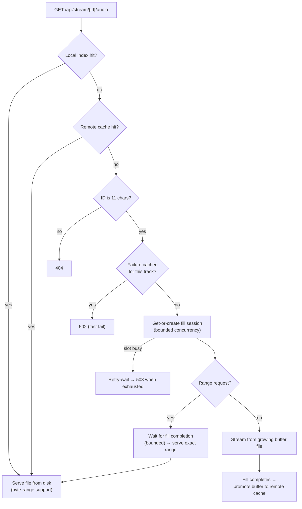
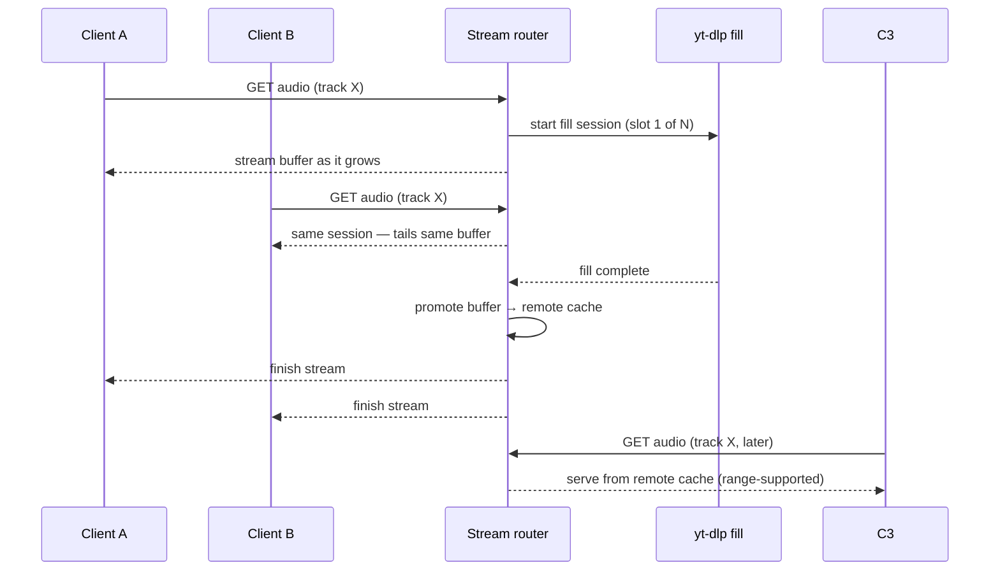

# Deep Dive — Streaming Pipeline

> Read [Architecture](ARCHITECTURE.md) first for the system map. This page explains how audio gets from "track tapped" to "sound in your ears", including the failure paths. Tunable numbers mentioned here live in `api/app/routers/stream_router.py` and `api/app/core/config.py`.

## The three tiers

1. **Local library** — the file index maps track IDs to paths on disk. A hit streams straight from the file with full `Range` support (`206 Partial Content`), so seeking costs nothing.
2. **Remote cache** — completed yt-dlp fills, kept per track with a TTL and an LRU cap. Served identically to local files (byte ranges included). Files are unlinked on eviction.
3. **Live fill session** — when neither cache has the track, one background yt-dlp process per track writes the full audio to a buffer file. Every concurrent listener tails that file as it grows.

## Why fill sessions exist

An earlier design spawned yt-dlp inside the first HTTP response, which produced four classes of bug — all fixed by the session model:

- Two simultaneous plays spawned **two yt-dlp processes** writing the same buffer file concurrently (corruption).
- A client disconnecting killed the only download.
- A disconnect mid-write promoted a **truncated file** to the cache as "valid".
- Seek requests during a stream spawned a *second* download from scratch.

Now: sessions are owned by no request, disconnects never touch the fill, only fully-written buffers are promoted, and range requests wait for completion (bounded) instead of racing.

## Concurrency control

- Fill sessions are capped (bounded slot count). Requests that arrive when all slots are busy retry briefly, then `503` — the client surfaces a "try again shortly" state rather than hanging.
- Sessions that finish are swept after an idle grace period by the cron library scan (`cleanup_expired_buffers`).
- The failure cache records tracks that recently failed upstream for a short TTL. Requests within that window fail fast (`502`) instead of spawning doomed processes — this is the anti-retry-storm mechanism.

## Byte-range serving

Range headers are parsed strictly (`bytes=START-END`, `bytes=START-`, suffix `bytes=-N`; multi-range takes the first range). Malformed or unsatisfiable ranges return `416`. Responses carry correct `Content-Range`, `Accept-Ranges`, and per-container MIME types.

## Failure paths

| Failure | Behavior |
|---------|----------|
| Malformed ID (≠11 chars) | `404` before any process spawn |
| yt-dlp produces no output / spawn timeout | Retry with alternating player clients/user agents, then `502` |
| Buffer write error | Cleanup temp file, kill process, retry, then `502` |
| Recent failure cached | `502` immediately (fast fail) |
| All fill slots busy | Bounded wait → `503` |
| Client disconnects mid-stream | Fill keeps running; other listeners unaffected |

## Related configuration

- Music directories scanned for the local index: `MUSIC_DIR` + `EXTRA_MUSIC_DIRS` (see [config.py](../api/app/core/config.py) for defaults)
- Cache TTLs, caps, slot limits, and timeouts: constants at the top of `stream_router.py`
- Cache maintenance: cron jobs in `api/app/main.py` (see [Operations](OPERATIONS.md))

---

*Last verified against `main`: 2026-09-10 (v2.16.5).*
