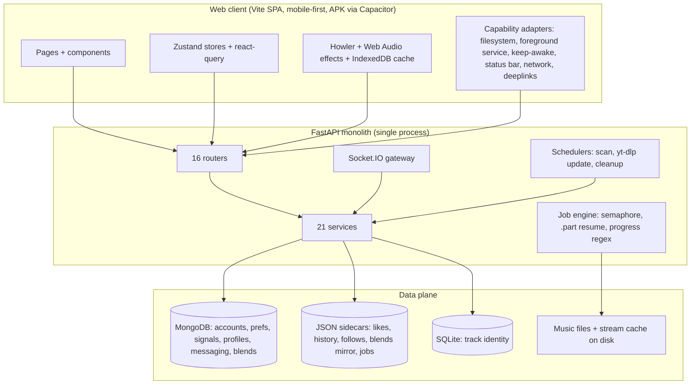

# Phase 1 — Discovery (Rheoson, as it exists on `dev` @ v2.22.1)

> Phase 1 of 8 · Agent: GLM 5.3 Flash · Method: software-architecture-analysis
> (clone → map → heaviest files → data ownership → contracts → constraints).
> Every claim is labeled **observed** (artifact seen this session), **inferred**
> (derived from evidence), or **unknown** (needs Phase 2 work).
> Clean-room rule honored: architecture described, no source reproduced.

## 1. System inventory (observed)

| Layer | Scale | Notes |
| --- | --- | --- |
| Backend (FastAPI) | 61 Python modules, ~16.3k lines | routers are thin, services carry logic |
| Frontend (React 18 + Vite) | 206 TS/TSX files, ~38.1k lines | ~5.5k of that is generated openapi types |
| Tests | 409 backend + 158 frontend | both suites green at v2.22.1 |
| Live layer | Socket.IO (`app:socket_app` ASGI wrapper) | downloads progress, player sync, messaging, presence |
| Storage | MongoDB (Motor) + JSON sidecars + SQLite sidecar + local files | mixed by feature |

Heaviest backend files (complexity magnets): stream router (~1.5k lines),
download service (~1.2k), app main (~830), yt-music service (~714),
recommendation router (~700), logging config (~650).

Heaviest frontend files: NowPlaying (~1.1k), Library (~1k), player hook (~720),
Search (~680), Home (~530), Settings Doctor (~500 each).

## 2. Feature surface (observed — what users can do)

- Discover/search tracks (YouTube-sourced), categories, trending (weekly cache).
- Play via a two-tier streamer: local file cache → remote resolve-then-tee with
  range support and a disk segment cache. Failures are DCCNN-coded.
- Download with jobs, progress over socket, `.part` resume, cancellation,
  foreground-service keepalive on Android.
- Library: local scan (device folders), albums, artists, favourites, history,
  playlists; **My Music merged into Library** (v2.22.0).
- Playlists CRUD, smart playlists, import/export, backup/restore.
- Social (v2.22.0): direct messages with rich shares (track/lyrics/playlist/
  album/artist/blend), presence ("listening to"), **Blends** (collaborative
  playlists, Mongo + JSON mirror).
- Accounts via Clerk; per-user synced preferences whitelist; listening stats,
  wrapped, taste profiles, recommendations.
- Error surfaces: DCCNN error-code registry (123 codes), coded toasts with
  ⓘ detail, dedicated error pages for 4xx/5xx states.

## 3. Architecture (observed + inferred)

Key structural facts:

- **The API is one deployable** — auth, streaming, downloads, social, analytics
  all share one process. Simple to run, but streaming bytes and JSON traffic
  share the same event loop; a slow download can contending with chat.
- **Client talks to API only**; the browser never touches Mongo or files.
  This rule already exists and the migration keeps it.
- **Identity contract**: `_file_id()` (MD5 of path) + SQLite `videoId → file`
  map is the trust anchor between "a YouTube track" and "a file on disk".
  Downloaded tracks keep their videoId identity (normalize.ts keys on it).
- **Error contract**: DCCNN codes, one registered code per raise site, wire
  format `[ERROR_CODE: DCCNN]`, frontend parser + chips. Both languages must
  share this after migration (packages/shared).
- **Capability adapter pattern (the desktop door)**: every native bridge
  (855 lines across 7 modules) sits behind an `isNativePlatform()` gate with
  web fallbacks. This is an *implicit* adapter contract — the migration makes
  it explicit with three implementations: web / android / **desktop (Tauri or
  Electron)**. Observed gates: filesystem scan/read, foreground download
  service, keep-awake, status bar, network status, deep links.

## 4. Data ownership map (observed)

| Data | Owner (write path) | Readers | Notes |
| --- | --- | --- | --- |
| Accounts, prefs, signals, profiles, messaging, blends | API (Mongo) | API only | clean server authority |
| Liked/history/follows/playlists | API (JSON sidecars + Mongo mirror) | API only | file-backed per user |
| Track identity (videoId→file) | Download service (SQLite) | streamer, library | **must not drift** — MD5 identity contract |
| Music files | Download/tagging pipeline | streamer, client | written once by downloads |
| Client caches | Client only (IndexedDB audio, snapshot localStorage) | client | disposable by design |

Inferred: the data plane is already cleanly partitioned — the TS server can
own accounts/social/playlists (JSON-in-Postgres), while the Python engine
keeps files, identity, and yt-dlp/ffmpeg. No data currently straddles that
line except the identity SQLite file, which stays with the engine.

## 5. Risks & constraints carried forward (observed/inferred)

1. **Stream relay semantics** (v2.21.4 lessons): range support, cache-tee only
   on complete bodies, upstream death diagnosed not thrown. The Go relay must
   reproduce these behaviors or fall back cleanly (inferred requirement).
2. **yt-dlp fragility** — daily update cron + Doctor repairs exist because
   extractors break regularly. The engine must keep both.
3. **Render free tier is ephemeral** — downloads/sidecars live on Termux today;
   the experiment assumes Docker-first deployment (user decision, recorded).
4. **Clerk issuer matching is host-exact**; env fails closed on typos. Both
   must survive the auth re-platform.
5. **no-warnings rule**: full-output enforcement + gates (tsc, eslint,
   pytest, pyflakes, vitest) must pass per milestone.
6. **Two navs / two shells** — device classification drives desktop sidebar vs
   mobile bottom nav; desktop web already has a real shell today (inferred:
   the APK forces mobile, desktop web is first-class already — the desktop
   *app* is what's missing).

## 6. Desktop support — the user's new requirement

**Observed**: desktop web renders the sidebar shell and full feature set
already; the native bridges gate on native platform. **Inferred target**:
a desktop app = the same Next.js client wrapped in a desktop shell (Tauri
preferred: ~10 MB binaries, Rust core, no Node runtime embedded; Electron
fallback if a Node API proves essential). The three adapters:

| Capability | Web | Android (today) | Desktop (new) |
| --- | --- | --- | --- |
| Local music scan | n/a | Capacitor Filesystem | Tauri fs plugin (user-granted dir) |
| Download to disk | server-managed | foreground service | engine-managed + notification |
| Keep-awake | Wake Lock API | plugin | Wake Lock / Tauri window flag |
| Network status | `navigator.onLine` | plugin | navigator + Tauri events |
| Deep links | n/a | plugin | custom protocol handler |

Phase 2 decides Tauri vs Electron; Phase 5 builds the adapter.

## 7. Discovery verdict — inputs to Phase 2

1. The system is a **clean two-part split**: JSON/social brain vs file/muscle
   engine. The migration boundary follows the data-ownership line — no
   feature requires straddling it.
2. **Contracts to freeze** (shared package): DCCNN error codes, track/normalize
   identity, query keys, API shapes (openapi is the spec today).
3. **Behaviors to port, not rewrite**: relay semantics, `.part` resume,
   scan/notification crons, Clerk verification, preference whitelist.
4. **The desktop requirement costs one adapter + one wrapper**, not a new
   architecture — the codebase's own gating pattern proves it.
5. **Prod-first is honored structurally**: every phase keeps `dev` shippable;
   the experiment never merges until the Phase 8 parity verdict.

## 8. Unknowns for Phase 2 (architecture must resolve)

- Postgres/Drizzle schema for the JSON brain (from Mongo/JSON sidecar shapes).
- Exact Go relay API shape (endpoints, cache layout, config).
- Engine ↔ server auth (service token vs mTLS) — **unknown**, must decide.
- BullMQ queue topology vs the current in-process job engine.
- Tauri vs Electron (decision criteria: fs access, autostart, tray, binary size).
- Meilisearch integration cost vs current in-API search.
