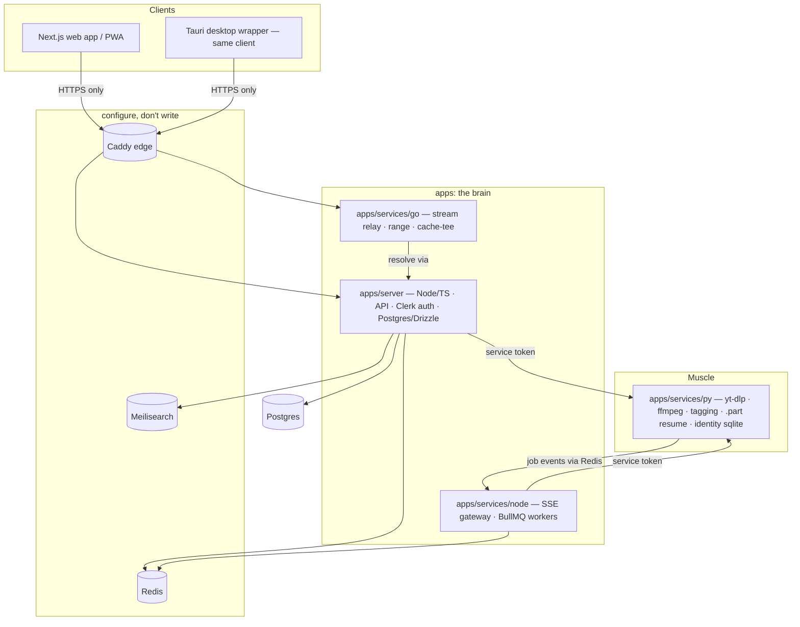

# Phase 2 — Target Architecture (Rheoson Next)

> Phase 2 of 8 · Agent: GLM 5.3 Flash · Inputs: `01-discovery.md` + user decisions
> (recorded in `EXPERIMENT_NEXT.md`): Next.js client+server, Postgres/Drizzle,
> slim Python engine, Go relay, Meilisearch, Docker+GHA, **desktop app support**,
> **prod on `dev` stays shippable throughout**.
> Every decision below is an ADR: context → options → decision → consequence.

## 1. Target shape

Talking rules (unchanged from the plan, now load-bearing):
1. Clients speak only to Caddy → server/relay. Nothing else is exposed.
2. Services authenticate to each other with a shared service token (ADR-3).
3. Every service is optional with a documented fallback (ADR-5).
4. `packages/shared` is the only place contracts live (ADR-6).

## 2. Data migration model — Mongo/JSON → Postgres

| Today | Postgres table(s) | Notes |
| --- | --- | --- |
| `users` (webhook-synced) | `users` | clerk_id PK, username, image_url |
| `users.preferences` doc | `user_preferences` (jsonb) | whitelist validated server-side, as today |
| `user_signals` | `listening_signals` | (user_id, signal, track_id, artist, ts) — the analytics workhorse |
| `taste_profiles`, `user_recommendations` | `taste_profiles` (jsonb) | recomputed by workers |
| JSON sidecars: liked/history/follows/disliked | `liked_tracks`, `listening_history`, `artist_follows`, `hidden_tracks` | proper rows; history indexed by (user_id, played_at) |
| `.playlists-*.json` | `playlists` + `playlist_tracks` | ids keep normalize.ts identity |
| `blends` (+ mirror) | `blends` + `blend_members` + `blend_tracks` | mirror dies — Postgres is always-on in Docker world |
| `conversations`/`messages` | `conversations`, `messages` | pair-id derivation moves to a server helper |
| `.download_jobs.json` | Redis (live) + `download_jobs` (audit) | BullMQ owns run-state |

**One-time importer**: a Phase-5 command reads Mongo/JSON sidecars and writes
Postgres, idempotent, dry-run mode. Likes/history survive the move.

## 3. ADRs — resolving the six unknowns

**ADR-1 · Queue: BullMQ + Redis (not in-process).**
Context: jobs today live in one process; a restart mid-download relies on
`.part` resume. Options: keep in-process in Node vs BullMQ. Decision: BullMQ
with a `downloads` queue + worker; `.part` resume logic ports verbatim into
the worker. Consequence: restart-safe jobs, priorities later, one more
dependency (accepted — Docker world).

**ADR-2 · Engine auth: static service token over internal network.**
Context: server↔engine calls (submit download, resolve, tag). Options: mTLS,
JWT signing, static token. Decision: `X-Engine-Token` header, 32-byte secret
in env, engine binds to the Docker-internal network only (never published).
Consequence: simple, sufficient inside the compose boundary; mTLS deferred
until multi-host (recorded as a known limit).

**ADR-3 · Go relay contract (I write it, ~500 lines).**
`GET /relay/audio?track={id}` with Range → resolves source via server
(`GET /internal/resolve/{id}`), streams bytes, tees complete bodies to
`CACHE_DIR`, never crashes on upstream death (ends clean + logs
`relay.upstream_died {relayed, expected}` — the v2.21.4 lesson, in Go).
`GET /relay/health`. Fallback: Node streams bytes itself when relay is down
(ADR-5). Consequence: the hottest path runs in the language built for it.

**ADR-4 · Desktop: Tauri, decided.**
Criteria from discovery: fs access for local scan (Tauri fs plugin with
user-granted dirs ✓), binary size (~10 MB vs ~150 MB), no embedded Node,
auto-update built in, tray via plugin. Electron wins only if we later need
Node-native libs inside the shell — unlikely; the client is a website.
Decision: Tauri wrapper, same Next client, third capability adapter.
Consequence: one Rust toolchain in CI; Phase 5 M4 builds it.

**ADR-5 · Optional-service fallbacks (contract, not hope).**
Search down → server's own Postgres/YouTube search (slower, works).
Relay down → Node byte-streaming path (today's code, ported). Redis down →
jobs queue in-process (degraded, no retries). Each fallback is a tested
behavior in Phase 6, not a comment.

**ADR-6 · `packages/shared` owns: DCCNN registry (ported from
error_codes.py — codes and copy identical), track identity/normalize types,
API client types (generated from server's openapi), query keys.**
Consequence: Python engine imports the DCCNN JSON export; drift impossible.

## 4. Build milestones inside Phase 5 (each ends visible, tagged v0.x)

| M | Ships | Proof |
| --- | --- | --- |
| M0 | Monorepo, Next client boots with ported tokens, error pages live | looks like Rheoson |
| M1 | Search + stream through Go relay + Howler chain | music plays (user's chosen first demo) |
| M2 | Clerk auth, accounts, prefs, history, playlists | your stuff follows you |
| M3 | Downloads: BullMQ worker, engine carve-out, SSE progress, DCCNN codes | coded progress + fail toasts |
| M4 | Blends/messages/presence on Postgres + **Tauri desktop build** | full parity candidate |

## 5. Prod-first guarantee (structural)

- `dev` (v2.x) keeps shipping: no experiment code is imported by web/ or api/.
- Experiment lives only under `apps/`, `packages/`, `infra/`, `skills/` —
  CI workflows for the old app untouched.
- Phase 8 sign-off is the only gate that can delete `web/`+`api/`, and it
  requires the parity checklist + user's explicit GO.

## 6. Risks accepted this phase

| Risk | Mitigation |
| --- | --- |
| Six runtimes = ops weight | Docker compose profile groups: `core` (server+relay+redis+pg), `full` (+engine, search, workers) |
| Data import drift | idempotent importer + dry-run + count verification in Phase 6 |
| Tauri unfamiliarity | smallest surface: load URL + fs plugin + updater; no custom Rust logic beyond config |
| Solo adversarial review (Phase 7) | explicit failure-pattern checklists + user as independent reviewer |

## 7. Exit criteria

Architecture is decided when: every ADR above has a named owner module in
the folder structure, the Postgres schema covers 100% of the data map in
`01-discovery.md` §4, and each discovery unknown maps to exactly one ADR.
Met — proceed to Phase 3 (documentation) on any session; this doc is the baton.
